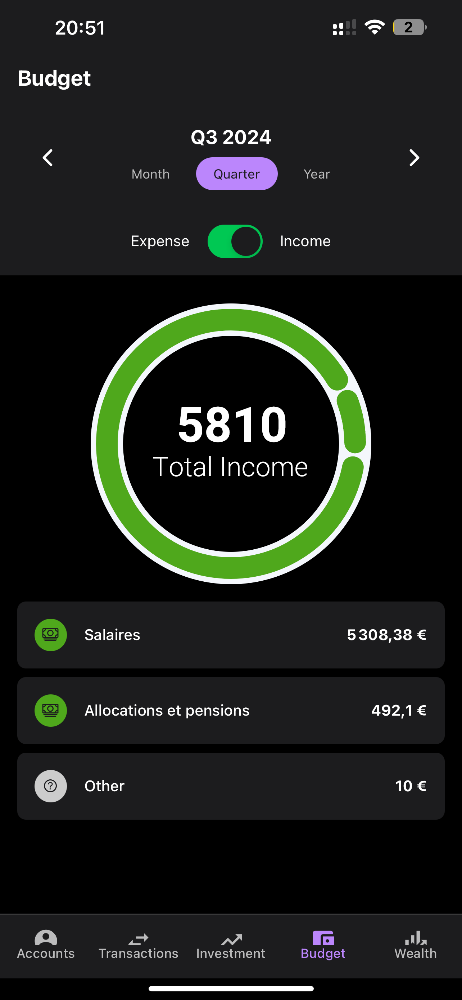

# Wealth Manager Mobile App 🚀

A sophisticated cross-platform mobile application for comprehensive wealth management, built with React Native and Expo. Track your finances, analyze spending patterns, and manage your investments - all in one beautifully designed app.


## ✨ Key Features

### 📊 Real-Time Wealth Tracking
- Interactive wealth evolution charts
- Multi-currency support
- Customizable date ranges (1M, 3M, 6M, 1Y, 3Y, 5Y, Max)


### 💰 Smart Account Management
- Multiple account types (Checking, Savings, Investment)
- Bank integration
- Real-time balance updates
- Detailed transaction history


### 📈 Budget Analytics
- Beautiful donut charts for expense categorization
- Customizable budget periods
- Detailed category breakdown
- Income vs Expense analysis




### 🔄 Transaction Management
- Easy transaction entry
- Smart categorization
- Detailed transaction view
- Transfer between accounts


### 🎨 Modern UI/UX
- Dark mode support
- Smooth animations
- Intuitive navigation
- Responsive design


## 🛠 Technical Stack

- **Frontend Framework**: React Native with Expo
- **State Management**: Redux
- **Charts**: react-native-gifted-charts
- **UI Components**: React Native Paper
- **Navigation**: Expo Router
- **API Integration**: Axios
- **Authentication**: JWT

## 🚀 Getting Started

1. Install dependencies:
```bash
npm install
```

2. Start the development server:
```bash
npx expo start
```

3. Run on your preferred platform:
- Press `i` for iOS simulator
- Press `a` for Android emulator
- Scan QR code with Expo Go app for physical device

## 📱 Platform Support

- iOS
- Android
- Web (Progressive Web App)

## 🔒 Security

- Secure authentication
- Encrypted data transmission
- Token-based API access
- Automatic session management

## 🎯 Future Roadmap

- [ ] Investment portfolio tracking
- [ ] AI-powered spending insights
- [ ] Bill payment reminders
- [ ] Custom category creation
- [ ] Export financial reports

## 📄 License

This project is licensed under the MIT License - see the [LICENSE](LICENSE) file for details.

## 🤝 Contributing

Contributions are welcome! Please feel free to submit a Pull Request.

